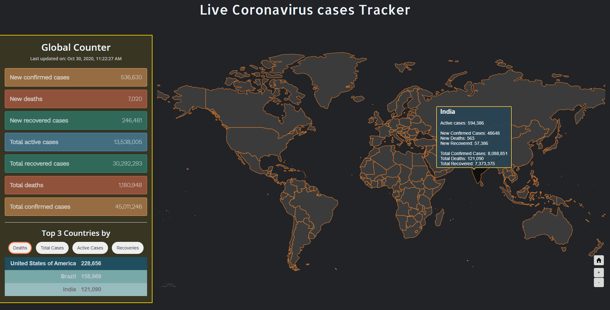
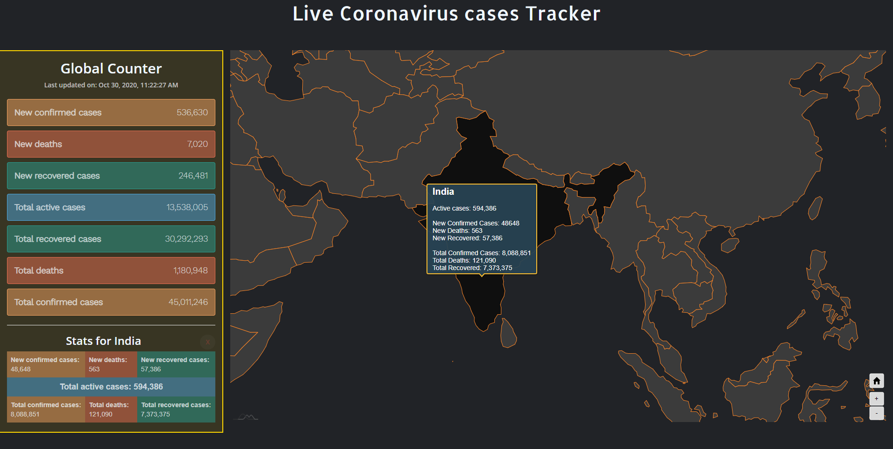

# Covid-19 Tracker

> This is a Covid-19 pandemic tracker which tracks following things:
>
> 1. New Recovered, Confirmed, Deaths
> 2. Total Recovered, Confirmed, Deaths
> 3. Active Cases
> 4. Top 3 contries with maximum
>    - Deaths
>    - Recoveries
>    - Active cases
>    - Confirmed cases

## Libraries & APIs used

- [AMCHARTS](https://www.amcharts.com/) for Map
- [API](https://documenter.getpostman.com/view/10808728/SzS8rjbc#00030720-fae3-4c72-8aea-ad01ba17adf8) for Corona stats

## Requirements:

- Node >= 14.11.0
- Angular CLI >= 10.0.14

## How to run?

1. Clone the repo (https://github.com/amannv2/Corona-stats.git) / [Download](https://github.com/amannv2/Corona-stats/archive/master.zip) zip and extract
2. Open terminal in the directory and run following commands:
   - `npm install` | installs dependencies
   - `ng s -o` | opens up the app in the browser

## Running Using Docker

1. Open terminal inside repo and run following commands:

   - `docker build --rm -t amannv2/corona-stats:latest .`
   - `docker run --rm -d -p 90:80/tcp amannv2/corona-stats:latest`

   > The ‘–rm’ flag is used to automatically clean up (remove) the container once it’s stopped. The ‘-d’ flag Is used to start the container in detached mode. Finally, we will connect port 90 of the host system to TCP traffic on port 80 within the image. Port 80 is the default port used by Nginx.

2. Open browser and navigate to http://localhost:90

## Screenshots

